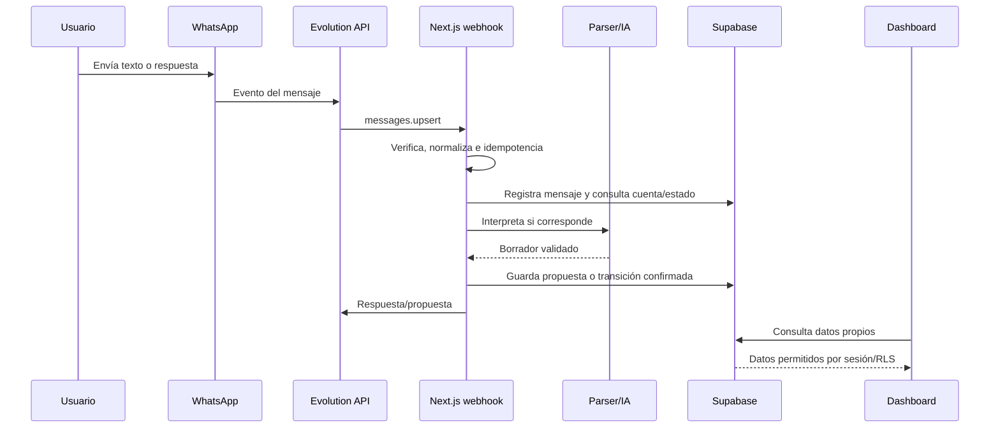

# Arquitectura real

Esta descripción se basa en el código, migraciones y configuración presentes en el repositorio.

## Aplicación web

`apps/web` es una aplicación Next.js 16 con App Router y React 19. Las páginas server-side consultan Supabase con la sesión del usuario. Las rutas API validan cuerpos con Zod y usan el cliente de servidor para autenticar; algunas operaciones de escritura usan el cliente administrativo después de comprobar la sesión y el `usuario_id`.

Superficies principales:

- `/login`: autenticación y confirmación de correo.
- `/auth/callback`: Route Handler de Next.js para intercambiar el código de autenticación por una sesión y redirigir al dashboard; no es una página UI.
- `/dashboard`: resumen principal, vinculación de WhatsApp y movimientos recientes.
- `/historial`: gastos e ingresos con filtros y acciones de historial.
- `/estadisticas`: gráficos, categorías y balance neto.
- `/presupuestos`: presupuestos mensuales por categoría.
- `/api/expenses/[id]`: actualización (`PATCH`) y eliminación (`DELETE`) de gastos autenticados.
- `/api/incomes/[id]`: eliminación (`DELETE`) de ingresos autenticados.
- `/api/budgets`: creación (`POST`) de presupuestos mensuales autenticados.
- `/api/account/whatsapp`: vinculación y código temporal de pairing.
- `/api/webhooks/whatsapp`: entrada de eventos de Evolution.
- `/api/health`: configuración mínima y conectividad con Supabase.

## Datos y seguridad

Supabase aloja Auth y las tablas de negocio. Las migraciones crean, entre otras, `usuarios`, `gastos`, `ingresos`, `mensajes_entrantes`, `categorias`, `categorias_ingreso`, `presupuestos_mensuales`, `whatsapp_vinculaciones_pendientes`, `whatsapp_contactos_lid`, `usuarios_roles` y auditoría de cambio de número.

RLS está habilitado y forzado en las tablas principales. Las políticas permiten al usuario leer sus propios datos; los gastos e ingresos se consultan filtrados por `usuario_id`. Los mensajes entrantes y datos operativos no se exponen al cliente autenticado. Las migraciones incluyen una función `transicionar_gasto` de `security definer` para el flujo controlado del servicio.

## Evolution API / WhatsApp

Evolution recibe la instancia y envía eventos `messages.upsert` al webhook. La aplicación:

1. Verifica el secreto del header y, si está presente, la firma HMAC.
2. Normaliza texto, botones, imágenes, timestamps, números E.164 y contactos LID.
3. Ignora eventos propios, eventos no soportados y estados no aplicables.
4. Registra `mensajes_entrantes` con una clave única por proveedor, instancia y mensaje de origen.
5. Marca el evento como procesando y evita duplicados mediante esa restricción.
6. Identifica la cuenta por el número vinculado; si hay un LID, mantiene un mapa persistente.
7. Envía respuestas por Evolution, con fallback de botones a `1`/`2`.

El pairing genera un código `MONI-...`, guarda únicamente su hash con expiración de 15 minutos y lo envía al número solicitado.

## Procesamiento de movimientos

El webhook enruta primero respuestas a un movimiento activo. Para texto usa parsers deterministas para gastos, ingresos, correcciones, consultas y presupuestos. El parsing de ingresos es exclusivamente determinista. Para gastos puede llamar a un modelo configurado con `AI_PROVIDER`, `AI_BASE_URL` y `AI_MODEL`; el contrato se valida con Zod y la ausencia/fallo del proveedor devuelve control al camino determinista.

Los movimientos pasan por estados de propuesta antes de confirmarse. La base impone un único gasto activo por usuario (`incompleto` o `pendiente_confirmacion`) y un único ingreso pendiente de confirmación. Los importes son enteros y la moneda de las tablas de negocio está restringida a `COP`.

## Despliegue

En producción, `docker-compose.prod.yml` define el proyecto Docker `moni` con seis servicios: Caddy, web, Ollama, Evolution API, PostgreSQL de Evolution y Redis de Evolution. Solo Caddy publica puertos; Supabase sigue siendo externo. El workflow `.github/workflows/deploy-vps.yml` hace `git pull --ff-only`, valida el Compose, actualiza imágenes fijadas, construye web, espera healthchecks y verifica `/api/health`.

## Flujo principal

La guía de operación y los comandos de despliegue están en [DEPLOYMENT.md](DEPLOYMENT.md), [LOCAL-SETUP.md](LOCAL-SETUP.md) y [BETA-OPERATIONS.md](BETA-OPERATIONS.md).
